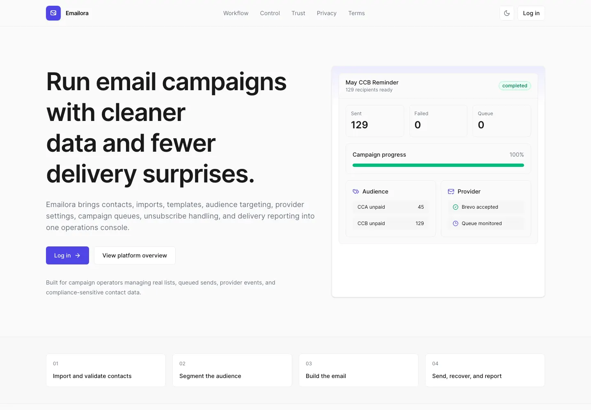
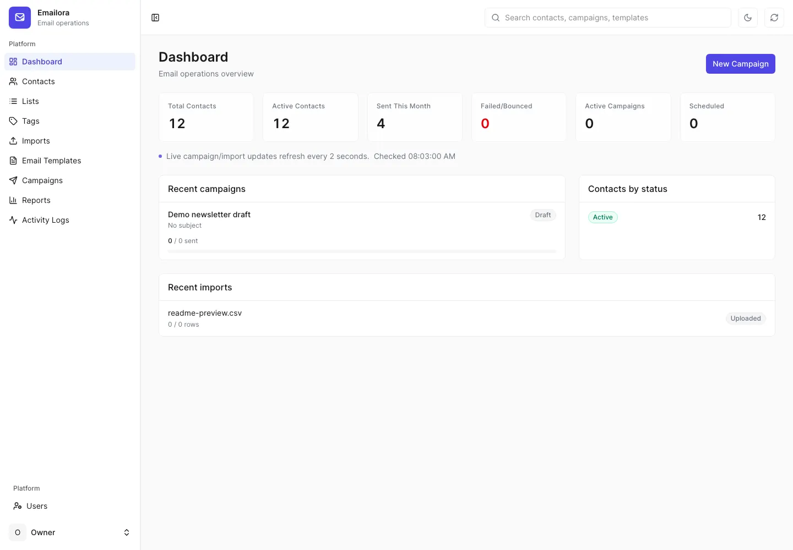
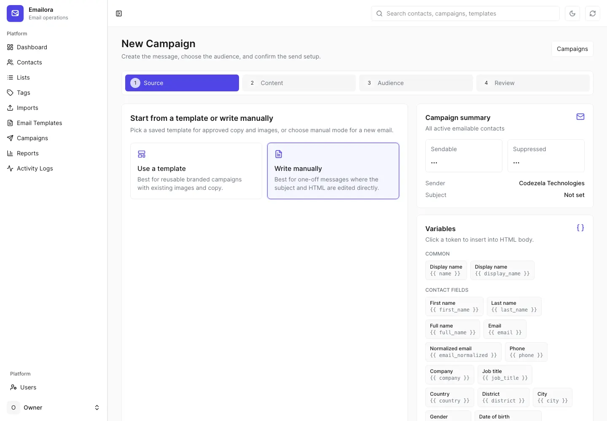
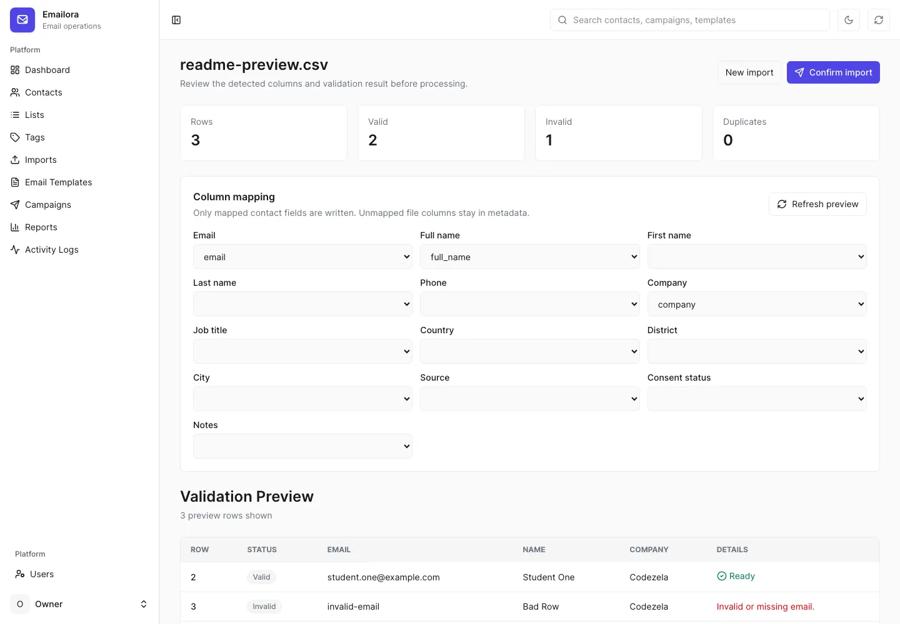
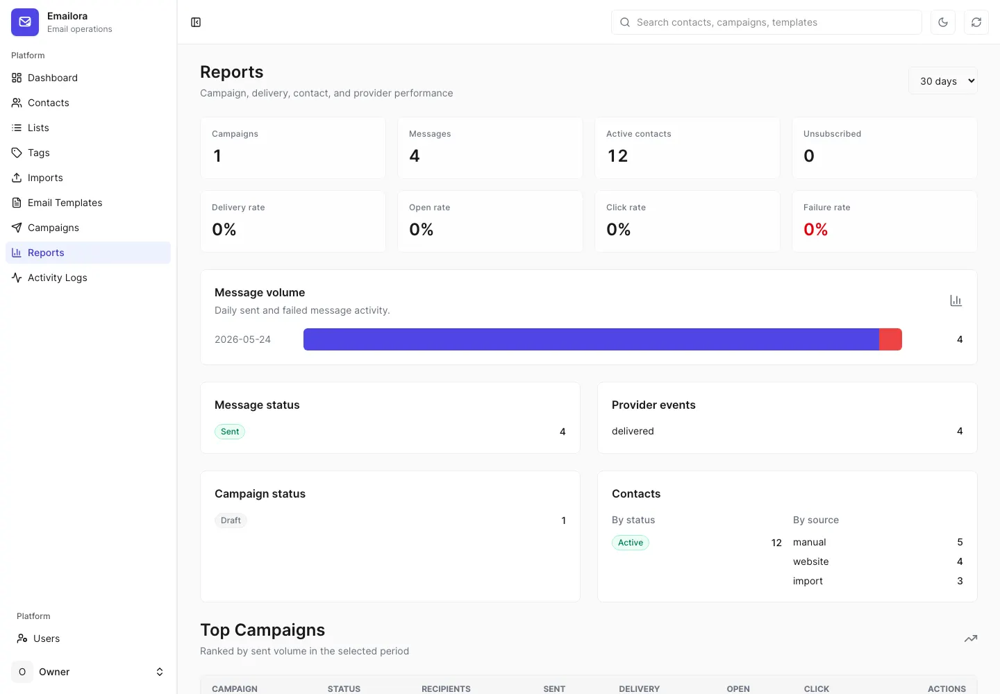

# Emailora

Emailora is a production-focused email campaign operations platform for teams that need reliable contact imports, segmentation, template personalization, campaign sending, delivery reporting, and auditable workspace operations.

It combines a public SEO-ready product surface with a private Laravel/Inertia/Vue workspace, and the local developer stack runs the web server, Vite, queues, scheduler, and logs together on `http://localhost:8000`.


## Contents

- [Screenshots](#screenshots)
- [Core Capabilities](#core-capabilities)
- [Dashboard And Navigation](#dashboard-and-navigation)
- [Users, Auth, And Settings](#users-auth-and-settings)
- [Architecture](#architecture)
- [Data Model](#data-model)
- [Route Map](#route-map)
- [Local Setup](#local-setup)
- [Environment](#environment)
- [Email Providers](#email-providers)
- [Imports](#imports)
- [Saved Segments](#saved-segments)
- [Campaigns](#campaigns)
- [Personalization](#personalization)
- [Reports](#reports)
- [Activity Logs](#activity-logs)
- [Public SEO](#public-seo)
- [Security And Data Safety](#security-and-data-safety)
- [Queues And Scheduler](#queues-and-scheduler)
- [Testing And Quality Gates](#testing-and-quality-gates)
- [Production Checklist](#production-checklist)
- [Operational Commands](#operational-commands)
- [Troubleshooting](#troubleshooting)

## Screenshots

The screenshots below are real desktop captures from the local application using a sanitized demo database. They do not include private local contact data, imported student data, provider secrets, or real campaign payloads. Each asset is a compressed WebP desktop screenshot at `1440x1000`.



| Dashboard | Campaign Builder |
| --- | --- |
|  |  |

| Import Validation Preview | Reports |
| --- | --- |
|  |  |

## Core Capabilities

### 📇 Contacts, Lists, And Tags

- Full contact CRUD with canonical duplicate detection through `contacts.email_normalized`.
- Searchable, paginated contact tables with export support.
- Contact status handling for active, inactive, blocked, unsubscribed, and suppressed recipients.
- List and tag management for segmentation.
- Bulk contact actions for list/tag assignment, status changes, and cleanup workflows.
- Owner/admin-controlled user management for workspace access.
- Global search across contacts, campaigns, templates, lists, and tags.

### 📥 Import Pipeline

- CSV, TXT, and XLSX imports up to 20 MB.
- Downloadable sample files for CSV and XLSX at `/imports/sample/csv` and `/imports/sample/xlsx`.
- Upload, validation preview, mapping adjustment, and confirm flow before database writes.
- Duplicate strategies for skip, update, list/tag-only attachment, and upsert.
- Failed-row download from import details.
- Private local storage for uploaded import files.
- Import processing on the `imports` queue with stuck/failure handling.

### ✉️ Templates And Personalization

- Template CRUD with preview and duplicate actions.
- HTML and text bodies.
- Subject, preview text, category, status, and reusable metadata.
- Dynamic variables using both `{{ variable }}` and legacy `{variable}` syntax.
- `metadata.<key>` support for custom imported fields.
- Variable preview support so campaign authors can see what data is available.
- Send-time blocking for unresolved variables so raw template variables do not ship.

### 🚀 Campaign Operations

- Campaign builder with template selection or manual body composition.
- Audience targeting by all contacts, lists, tags, saved segments, advanced filters, and selected contacts.
- Estimated recipient counts before send.
- Draft, scheduled, queued, sending, sent, failed, paused, canceled, and completed workflow handling.
- Test sends.
- Send to current audience or only newly eligible contacts after editing.
- Recipient detail view with per-recipient status.
- Resend failed recipients and retry individual failed recipients.
- Pause, resume, cancel, duplicate, preview, and report flows.
- Required unsubscribe handling for real sends.

### 📊 Reports

- Workspace reporting at `/reports`.
- Campaign-level reporting at `/reports/campaigns/{campaign}`.
- Delivery, sent, failed, bounced, opened, clicked, and unsubscribed metrics where event data exists.
- Campaign export route for reporting data.
- Consistent table pagination and overflow-safe table shells.

### 🧾 Activity Logs

- Owner/admin-only audit surface at `/activity-logs`.
- Search and filters for category, event, severity, actor, and path.
- Export using the same filters as the visible log view.
- Logs for auth events, model changes, imports, campaigns, list/tag operations, contact bulk actions, webhook acceptance/rejection, and queue-sensitive actions.
- Recursive redaction for secrets, provider payloads, request tokens, headers, raw import rows, personalized email bodies, cookies, and signatures.

### 🌐 Public Product Surface

- Public homepage at `/`.
- Legal pages at `/privacy` and `/terms`.
- Stateless `/robots.txt` and `/sitemap.xml`.
- Server-rendered metadata for title, description, robots, canonical URL, Open Graph, Twitter cards, and homepage JSON-LD.
- Auth pages are noindexed; authenticated workspace routes are excluded from the sitemap.

## Dashboard And Navigation

The authenticated workspace starts at `/dashboard`.

Dashboard widgets include:

- Total contacts.
- Active contacts.
- Messages sent this month.
- Failed and bounced messages.
- Active campaigns.
- Scheduled campaigns.
- Recent campaigns with delivery counters.
- Recent imports with processing counts.
- Contact status breakdown.

Workspace navigation covers dashboard, contacts, lists, tags, imports, templates, campaigns, segments, reports, activity logs, users, and settings. Global search is available through `/global-search` and returns grouped results with URLs for contacts, campaigns, templates, lists, and tags once the query has at least two characters.

## Users, Auth, And Settings

Authentication and account features:

- Laravel Fortify login and logout.
- Password reset and password confirmation routes.
- Email verification routes are present.
- Two-factor challenge, QR code, secret key, recovery-code regeneration, enable, confirm, and disable routes are present.
- Public registration remains disabled for normal product usage.

Workspace access rules:

- Authenticated workspace routes require `auth` and `active`.
- Owner/admin-only areas include user management and activity logs.
- Inactive users are logged out before reaching workspace routes.
- Profile, security, password, and appearance routes are protected by authenticated active-user middleware.

Settings features:

- General workspace settings.
- Email provider defaults.
- Provider test-email action.
- Profile updates.
- Password changes.
- Account deletion flow.
- Appearance mode route for light/dark/system preferences.

## Architecture

Emailora uses Laravel as the application and queue runtime, Inertia as the server/client bridge, and Vue 3 for the authenticated workspace and public pages.

| Layer | Implementation |
| --- | --- |
| Backend | Laravel 13 controllers, Form Requests, Eloquent models, database queues |
| Frontend | Inertia, Vue 3, TypeScript, Tailwind CSS 4 |
| UI Components | Shared Emailora components in `resources/js/components/emailora` plus local UI primitives |
| Auth | Laravel Fortify, role middleware, active-user boundary middleware |
| Queues | Database queues for `email`, `imports`, and `default` |
| Providers | Resend and Brevo adapters behind the internal email service |
| Imports | CSV/TXT via `fgetcsv()`, XLSX through `App\Services\Imports\ContactImportFile` |
| Auditing | `activity_logs` table, observers, explicit semantic logs for bulk/queue/webhook work |
| SEO | Public Inertia pages plus Blade fallback metadata for crawler-visible tags |

Important paths:

- `app/Http/Controllers` - HTTP workflow controllers.
- `app/Http/Requests` - validation and normalization.
- `app/Jobs` - import, campaign, and webhook queue jobs.
- `app/Services/Email` - provider payloads, personalization, delivery, and webhook events.
- `app/Services/Imports` - file parsing, preview, mapping, and duplicate analysis.
- `resources/js/pages` - Inertia pages.
- `resources/js/components/emailora` - shared application UI.
- `routes/web.php` - public, workspace, unsubscribe, and webhook routes.
- `routes/settings.php` - profile, security, and appearance routes.
- `tests/Feature` and `tests/Unit` - regression and behavior coverage.

## Data Model

Primary tables:

- `users` - owner/admin/staff accounts, status, two-factor fields, and login metadata.
- `contacts` - canonical subscriber/contact records with normalized email, lifecycle status, consent, engagement timestamps, and metadata.
- `lists` - mailing lists through `App\Models\ListModel`.
- `tags` - flexible labels for segmentation.
- `contact_list` and `contact_tag` - membership pivots.
- `contact_imports` - import jobs, mapping, summary, assigned lists/tags, failure state, and stored file path.
- `import_rows` - per-row import results and downloadable failure details.
- `email_templates` - reusable campaign templates.
- `email_campaigns` - campaign configuration, body, targeting, scheduling, counters, and status.
- `campaign_recipients` - prepared recipients for each campaign.
- `email_messages` - provider send attempts and message state.
- `email_events` - provider delivery/open/click/bounce/unsubscribe events.
- `email_suppressions` - normalized addresses blocked by bounce, complaint, or unsubscribe.
- `saved_segments` - reusable audience filter definitions.
- `system_settings` - workspace defaults.
- `activity_logs` - sanitized operational audit trail.
- `jobs`, `job_batches`, and `failed_jobs` - database queue runtime.

Important invariants:

- `contacts.email_normalized` is the duplicate key and is normalized on save.
- Contact list/tag membership is managed through pivots, not direct contact attributes.
- Campaign recipients are prepared before sending and retain campaign-specific status.
- Provider events are idempotent by provider event identity where available.
- Suppressed contacts are excluded from emailable campaign audiences.
- Import files stay private and are deleted when their import record is deleted.

## Route Map

Public routes:

- `/`
- `/privacy`
- `/terms`
- `/robots.txt`
- `/sitemap.xml`
- `/unsubscribe/{signedToken}`
- `/webhooks/email/resend`
- `/webhooks/email/brevo`
- `/up`

Authenticated workspace routes:

- `/dashboard`
- `/global-search`
- `/contacts`
- `/lists`
- `/tags`
- `/imports`
- `/templates`
- `/campaigns`
- `/segments`
- `/reports`
- `/settings`
- `/profile`
- `/settings/profile`
- `/settings/security`
- `/settings/appearance`

Owner/admin routes:

- `/users`
- `/activity-logs`
- `/activity-logs/export`

Campaign-specific routes include builder, audience contacts, audience estimate, preview, send, test send, recipients, report, resend failed, resend individual recipient, pause, resume, cancel, duplicate, edit, update, destroy, and show.

## Local Setup

Use the full local stack, not only `php artisan serve`.

```bash
composer install
npm install
cp .env.example .env
php artisan key:generate
php artisan migrate --seed
npm run build
composer dev
```

`composer dev` starts:

- Laravel on `http://127.0.0.1:8000` and `http://localhost:8000`.
- Vite on `http://localhost:5173`.
- Queue listener for `email,imports,default`.
- Scheduler loop through `php artisan schedule:work`.
- Live Laravel logs through `php artisan pail`.

Default local owner credentials:

```text
Email: owner@example.com
Password: password
```

Change `OWNER_EMAIL` and `OWNER_PASSWORD` before seeding any non-local environment.

## Environment

The app reads runtime configuration from `.env`. Never commit `.env` or provider secrets.

Minimum local configuration:

```dotenv
APP_NAME=Emailora
APP_ENV=local
APP_DEBUG=true
APP_URL=http://localhost:8000
APP_TIMEZONE=Asia/Colombo

DB_CONNECTION=sqlite
DB_DATABASE=database/database.sqlite
QUEUE_CONNECTION=database
DB_QUEUE_RETRY_AFTER=420

OWNER_NAME=Owner
OWNER_EMAIL=owner@example.com
OWNER_PASSWORD=password

EMAIL_PROVIDER=resend
EMAIL_FALLBACK_PROVIDER=
EMAIL_FROM_NAME="Emailora"
EMAIL_FROM_ADDRESS=team@codezela.com
EMAIL_REPLY_TO=team@codezela.com
EMAIL_RATE_LIMIT_PER_MINUTE=300
EMAIL_CHUNK_SIZE=50
EMAIL_TIMEOUT_SECONDS=30
EMAIL_TRACK_OPENS=true
EMAIL_TRACK_CLICKS=true

RESEND_API_KEY=
RESEND_WEBHOOK_SECRET=
BREVO_API_KEY=
BREVO_WEBHOOK_SECRET=
```

Other environment groups present in `.env.example`:

- Locale and timezone: `APP_LOCALE`, `APP_FALLBACK_LOCALE`, `APP_FAKER_LOCALE`, `APP_TIMEZONE`.
- Logging: `LOG_CHANNEL`, `LOG_STACK`, `LOG_DEPRECATIONS_CHANNEL`, `LOG_LEVEL`.
- Sessions and cache: `SESSION_DRIVER`, `SESSION_LIFETIME`, `SESSION_DOMAIN`, `CACHE_STORE`.
- Mail transport fallback: `MAIL_MAILER`, `MAIL_HOST`, `MAIL_PORT`, `MAIL_USERNAME`, `MAIL_PASSWORD`, `MAIL_FROM_ADDRESS`, `MAIL_FROM_NAME`.
- Redis and Memcached connection settings inherited from Laravel's cache/queue configuration.
- AWS storage env keys inherited from Laravel's default template; the current import workflow uses the local/private disk unless storage is explicitly extended.
- `VITE_APP_NAME` for frontend display/runtime metadata.

Production requirements:

- `APP_ENV=production`.
- `APP_DEBUG=false`.
- `APP_URL` must be the final public HTTPS origin.
- `QUEUE_CONNECTION=database` or a production queue backend wired with equivalent queues.
- `DB_QUEUE_RETRY_AFTER` greater than the queue worker timeout.
- Secure session and cookie settings for the deployed domain.
- A production database with migrations applied.
- A monitored queue worker.
- A cron entry that runs Laravel's scheduler every minute.

Emailora fails production boot when `APP_URL` points to localhost because canonical URLs, Open Graph metadata, robots output, and sitemap URLs must be public and absolute.

## Email Providers

Emailora currently supports Resend and Brevo provider adapters.

Effective provider env keys:

- `EMAIL_PROVIDER` - `resend` or `brevo`.
- `EMAIL_FALLBACK_PROVIDER` - optional fallback provider name.
- `EMAIL_FROM_ADDRESS` - verified sender address.
- `EMAIL_FROM_NAME` - sender display name.
- `EMAIL_REPLY_TO` - reply-to address.
- `RESEND_API_KEY` - Resend API key.
- `RESEND_WEBHOOK_SECRET` - Resend webhook signing secret.
- `BREVO_API_KEY` - Brevo API key.
- `BREVO_WEBHOOK_SECRET` - Brevo webhook signing secret.

`BREVO_SMTP_API_KEY` is accepted as a backwards-compatible local alias, but `BREVO_API_KEY` is the canonical key. The UI reports missing or rejected provider configuration as a real failure; it does not display fake send success.

Webhook endpoints:

- `POST /webhooks/email/resend`
- `POST /webhooks/email/brevo`

Webhook controllers validate signatures, dispatch sanitized `EmailWebhookEvent` objects to the `email` queue, and keep duplicate provider events idempotent.

Campaign send jobs attach stable provider idempotency headers per campaign recipient: `Idempotency-Key` for Resend and `idempotencyKey` for Brevo. This reduces duplicate-delivery risk if a queue worker retries after a provider accepted a message but before local persistence completed.

## Imports

Import flow:

1. Download a CSV or XLSX sample.
2. Upload a file.
3. Review the validation preview.
4. Adjust field mapping.
5. Choose list/tag assignment.
6. Choose duplicate handling.
7. Confirm processing.
8. Review results and download failed rows if needed.

Supported fields:

- `email` - required.
- `full_name`, `first_name`, `last_name`.
- `phone`, `company`, `job_title`.
- `city`, `state`, `country`, `timezone`.
- `source`, `consent_status`, `notes`.
- Any unmapped column, stored as contact metadata.

Duplicate modes:

- `skip` - create only new contacts and leave existing contacts unchanged.
- `update` - update existing contacts only; missing contacts are reported as failed rows.
- `add_to_list_tag` - attach selected lists/tags to existing contacts without overwriting contact fields.
- `upsert` - create missing contacts and update existing contacts.

Import safety:

- Uploaded files are private local storage files.
- Import files are removed when the import record is deleted.
- Failed processing marks the import as failed instead of leaving it stuck in `queued` or `processing`.
- Validation preview rejects mappings to missing columns.
- Import queue jobs are unique per import while pending or processing.

## Saved Segments

Saved segments store reusable audience filters at `/segments`.

Segment filters are JSON definitions. Supported filter keys include:

- `status`
- `source`
- `country`
- `district`
- `city`
- `company`
- `consent_status`
- `search`
- `list_ids` or `lists`
- `tag_ids` or `tags`
- `contact_ids`

Segment preview uses the same emailable-contact rules as campaign audience resolution and returns the matching count plus a sample of matching contacts. Campaign audiences can use a segment with:

```json
{
  "target_type": "saved_segment",
  "target_filters": {
    "segment_id": 1
  }
}
```

Advanced filters use the same keys directly:

```json
{
  "target_type": "advanced_filter",
  "target_filters": {
    "source": "import",
    "tag_ids": [3, 7]
  }
}
```

## Campaigns

Campaign lifecycle:

```text
draft -> scheduled -> queued -> preparing -> sending -> sent/completed
                  \-> paused -> sending
                  \-> canceled
                  \-> failed
```

Common actions:

- Create a campaign from a template.
- Create a manual campaign without a template.
- Save as draft.
- Schedule for later.
- Send now.
- Send a test email.
- Edit draft and scheduled campaigns.
- Duplicate existing campaigns.
- Pause/resume active sending.
- Cancel queued/scheduled/sending campaigns.
- Retry failed recipients.
- Retry an individual failed recipient.
- View recipients and delivery status.
- Open campaign-specific reports.

When an already prepared campaign is edited, sending can target:

- `current_audience` - rebuild unsent recipients from the current campaign targeting.
- `new_contacts` - add only newly eligible contacts not already prepared for the campaign.

A queued or preparing campaign with no prepared recipients yet should still show the estimated target audience count in the UI.

## Personalization

Supported variable syntax:

```text
{{ name }}
{{ email }}
{{ first_name }}
{{ last_name }}
{{ company }}
{{ phone }}
{{ metadata.programme }}
{{ unsubscribe_url }}
```

Legacy single-brace syntax is also supported:

```text
{name}
{metadata.programme}
```

Resolution rules:

- `{{ name }}` resolves from full name, first/last name, company, then email.
- `metadata.<key>` resolves from imported custom metadata.
- `{{ unsubscribe_url }}` is generated per campaign recipient.
- Real sends require an unsubscribe link.
- If a body does not include an unsubscribe variable, Emailora appends a compliant footer.
- Unresolved variables block sending so recipients do not receive raw variables.

## Reports

Reports are split between workspace-level and campaign-level views.

Workspace reports include:

- Campaign volume.
- Recipient status counts.
- Delivery and failure trends.
- Recent campaigns.
- Exportable campaign metrics.

Campaign reports include:

- Audience size.
- Sent, failed, bounced, opened, clicked, and unsubscribed counts.
- Recipient table access.
- Export action for campaign reporting data.

## Activity Logs

Activity logs are not provider delivery logs. They are the operational audit trail for what happened inside the application.

Logged categories include:

- Auth sign-ins.
- Contact creates, updates, deletes, block, unsubscribe, and bulk actions.
- List and tag changes.
- Import upload, preview, confirm, process, failure, and delete events.
- Template lifecycle events.
- Campaign send, test send, pause, resume, cancel, retry, duplicate, and recovery events.
- Webhook accepted/rejected events.
- Settings and user-management changes.

Redaction rules protect:

- API keys and provider secrets.
- Webhook signatures and request tokens.
- Cookies, headers, and authorization values.
- Raw import rows.
- Provider payloads.
- Personalized email bodies.

## Public SEO

Public routes:

- `/`
- `/privacy`
- `/terms`
- `/robots.txt`
- `/sitemap.xml`

SEO features:

- Server-visible `<title>` and meta description.
- Absolute canonical URLs from `APP_URL`.
- Per-page robots metadata.
- Open Graph and Twitter card metadata.
- Homepage JSON-LD for the Emailora web application and Codezela Technologies publisher.
- Cookie-free robots and sitemap responses.
- Authenticated workspace disallowed in robots and excluded from sitemap.
- Auth pages marked `noindex,follow`.

Production must never use a localhost `APP_URL`.

## Security And Data Safety

Core safety decisions:

- `.env` is ignored and must never be committed.
- Provider secrets are read only from environment variables.
- Public registration is disabled.
- Users are managed by owner/admin roles.
- Settings, profile, security, and appearance routes require authenticated active users.
- Inactive users are logged out before workspace access.
- Webhook routes reject invalid signatures.
- Unsubscribe links use signed URLs.
- Contact duplicate handling uses normalized email.
- Import files remain private.
- Activity logs redact sensitive values.
- Browser-facing invalid workflow states redirect with flash messages instead of raw exception pages.

Before changing local campaign/contact data, inspect counts and avoid destructive deletes unless the operator explicitly asked for them.

## Queues And Scheduler

Local development:

```bash
composer dev
```

Manual equivalent:

```bash
php artisan serve --host=127.0.0.1 --port=8000
php artisan queue:work --queue=email,imports,default --tries=3 --timeout=300 --sleep=1
php artisan schedule:work
npm run dev
```

Production worker:

```bash
php artisan queue:work --queue=email,imports,default --tries=3 --timeout=300 --sleep=1 --max-time=3600
```

Production scheduler:

```bash
* * * * * cd /path/to/emailora && php artisan schedule:run >> /dev/null 2>&1
```

Campaign operations commands:

```bash
php artisan emailora:campaigns:queue-scheduled
php artisan emailora:campaigns:recover
php artisan emailora:campaigns:finalize-stuck
```

Queue notes:

- Campaign sends use the `email` queue.
- Imports use the `imports` queue.
- Webhook processing uses the `email` queue.
- Recovery commands repair stuck queued/preparing/sending campaigns.
- `DB_QUEUE_RETRY_AFTER` should be greater than the worker timeout; `420` is the documented local value for a `300` second timeout.

## Testing And Quality Gates

Primary quality gate:

```bash
composer ci:check
```

What it runs:

- PHP style check through Pint.
- Frontend formatting check.
- TypeScript/Vue type check.
- Full Laravel test suite.

Additional gates:

```bash
npm run format:check
npm run lint:check
npm run types:check
npm run build
php artisan test
composer validate --strict
composer audit
npm audit --audit-level=high --omit=dev
php artisan route:cache
php artisan config:cache
php artisan view:cache
php artisan optimize:clear
```

Current verified coverage includes:

- Public pages and legal pages.
- Public SEO metadata.
- Cookie-free robots and sitemap routes.
- Authenticated workspace route smoke tests.
- Auth, active-user boundaries, profile, security, and appearance access.
- Contacts, lists, tags, and exports.
- Import upload, mapping, preview validation, confirm, queue processing, delete, samples, and failed-row behavior.
- Template CRUD, preview, duplicate, and personalization handling.
- Campaign audience estimates, builder flows, send, test send, retry, pause, resume, cancel, duplicate, reports, and recipient edge cases.
- Reports and exports.
- Settings and provider test-email success/failure states.
- Unsubscribe signed URL flow.
- Webhook signature handling, queue dispatch, processing, suppression updates, and idempotency.
- Activity log visibility and export behavior.

Last full local verification result:

```text
php artisan test
174 tests, 164 passed, 10 skipped, 1385 assertions
```

## Production Checklist

Before deploying:

- Set `APP_ENV=production`.
- Set `APP_DEBUG=false`.
- Set a public HTTPS `APP_URL`.
- Configure the production database.
- Run migrations.
- Build frontend assets with `npm run build`.
- Confirm `public/hot` is absent.
- Configure a monitored queue worker.
- Configure the scheduler cron.
- Set `DB_QUEUE_RETRY_AFTER` greater than worker timeout.
- Add provider API keys only in the production secret store.
- Verify the sending domain and sender email in the provider dashboard.
- Configure provider webhooks to the production webhook URLs.
- Run `composer ci:check`.
- Run `composer audit`.
- Run `npm audit --audit-level=high --omit=dev`.
- Run `php artisan route:cache`, `config:cache`, and `view:cache`.
- Smoke test `/`, `/privacy`, `/terms`, `/robots.txt`, `/sitemap.xml`, `/login`, `/dashboard`, imports, a test send, and a real provider webhook signature path.

After deploying:

- Monitor queue depth and `failed_jobs`.
- Monitor campaign counts and stuck statuses.
- Monitor provider bounce/suppression events.
- Review activity-log retention requirements.
- Confirm sitemap and robots output use the production origin.
- Confirm canonical and Open Graph URLs are not localhost.

## Operational Commands

Create or refresh local database:

```bash
php artisan migrate:fresh --seed
```

Run only the test suite:

```bash
php artisan test
```

Run a focused test:

```bash
php artisan test --filter=CampaignLifecycleTest
```

Clear cached framework state:

```bash
php artisan optimize:clear
```

Check pending and failed database jobs:

```bash
php artisan tinker
DB::table('jobs')->count();
DB::table('failed_jobs')->count();
```

Run campaign recovery manually:

```bash
php artisan emailora:campaigns:recover
php artisan emailora:campaigns:finalize-stuck
```

Inspect the full route surface:

```bash
php artisan route:list
```

Validate Composer metadata:

```bash
composer validate --strict
```

Check dependency advisories:

```bash
composer audit
npm audit --audit-level=high --omit=dev
```

## Troubleshooting

Queued campaigns or imports do not move:

- Confirm `composer dev` is running locally, or start a worker with `php artisan queue:work --queue=email,imports,default --tries=3 --timeout=300 --sleep=1`.
- Check `DB::table('jobs')->count()` and `DB::table('failed_jobs')->count()`.
- Run `php artisan emailora:campaigns:recover` for stuck campaigns.
- Confirm `DB_QUEUE_RETRY_AFTER` is greater than the worker timeout.

Emails say queued but do not deliver:

- Confirm `EMAIL_PROVIDER` is set to `resend` or `brevo`.
- Confirm the relevant API key is present in `.env`.
- Use `/settings` test email before sending a campaign.
- Confirm the sending domain and sender are verified in the provider dashboard.
- Check `failed_jobs`, activity logs, and provider response errors.

Public SEO URLs show localhost:

- Set `APP_URL` to the final public HTTPS origin.
- Clear cached config with `php artisan optimize:clear`.
- Rebuild caches with `php artisan config:cache`, `route:cache`, and `view:cache`.

Frontend does not update:

- Confirm Vite is running on `5173`.
- Restart `composer dev`.
- Clear browser cache if the old build was loaded.
- Run `npm run build` before production smoke testing.

Imports fail validation:

- Download the sample CSV/XLSX first.
- Confirm the mapped email column exists in the uploaded file.
- Check duplicate handling mode.
- Download failed rows from the import detail page.

Activity logs do not show an expected event:

- Confirm the action completed through the application route, not a direct database edit.
- Remember bulk query updates and pivot syncs require explicit semantic logs.
- Check owner/admin access because `/activity-logs` is role-restricted.

## License

Emailora is released under the MIT license.
